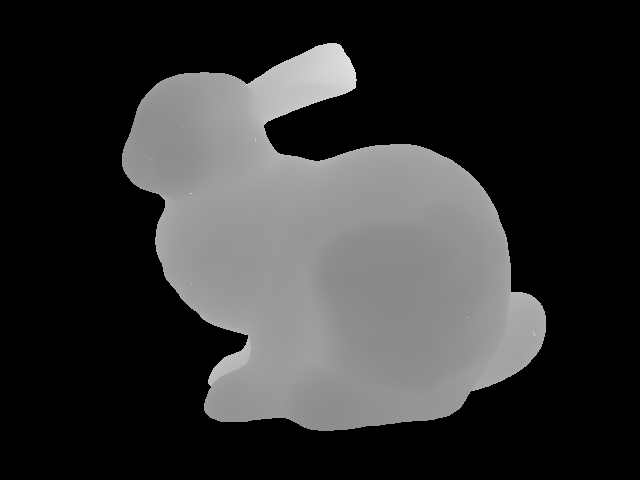
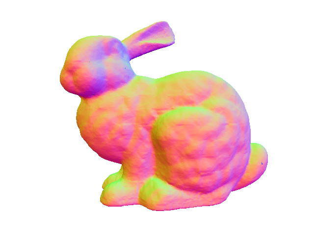

Deep Local Shapes
=== 

An attempt to replicate the work of [deep local shapes](https://arxiv.org/abs/2003.10983). Since the original authors didn't open-source their code, I decided to write my own. Please note this repo may not represent the quality of the original work, nor does it cover every aspect of the paper.

|depth map|normal map|
|:--:|:--:|
|||

## Pre-requisites

1. The newest `Pytorch`, tested with `CUDA 11.1 update 1` :`pip3 install torch==1.9.0+cu111 torchvision==0.10.0+cu111 torchaudio==0.9.0 -f https://download.pytorch.org/whl/torch_stable.html`
2. `Trimesh` for mesh-based sampling: `pip install trimesh pyrender`

## Data-preparation

1. Use `sampler.py` to generate training/evaluation data.
2. A standalone example can be generated with `python sampler.py input/bun_zipper.ply output/ --voxel_size 0.01`

## Training

1. Use `trainer.py` to train the network.
2. Use `reconstruct.py` to reconstruct the scene from the learned latents